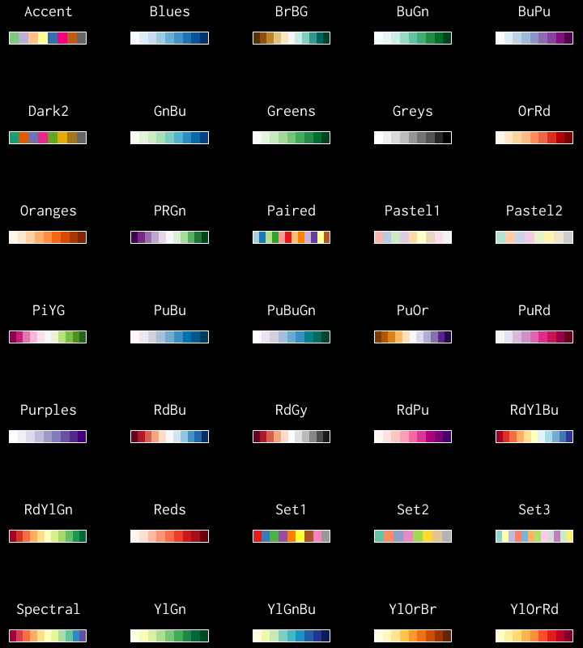

# mcbrewer

MATLAB colormaps based on Cynthia Brewer's color schemes



## Usage

`MAP = mcbrewer('SCHEME')` returns a colormap for the specified `SCHEME`, with the same number of colors as the current figure. If no figure exists, `mcbrewer` uses the length of the default colormap, which is 256 by default.

`MAP = mcbrewer('SCHEME',N)` returns an N-by-3 matrix containing a colormap. If `N` is larger than the maximum number of colors in the original colormap, `mcbrewer` uses linear interpolation to obtain additional color values.

`MAP = mcbrewer('SCHEME',N,I)` extracts numel(I)-by-3 subcolormap specified by the color index `I` from the colormap.

Calling `mcbrewer` without input/output arguments displays a list of available color schemes, their types, and the number of colors in the original colormap.

Each color scheme has a corresponding wrapper function for `mcbrewer` named after the scheme itself:
```  
>> map = scheme(n)
```
This works in the same manner as:
```
>> map = mcbrewer('Scheme',n)
```
This provides a convenient method for setting the colormap of the current figure:
```
>> colormap(scheme)
```
By default, these wrapper functions are organized within a namespace `+colorbrewer/+schemes`. To access those functions, type:
```
>> map = colorbrewer.schemes.scheme(n)
```
or:
```
>> import colorbrewer.schemes.*
>> map = scheme(n)
```

## Inputs:

- `scheme` : String specifying the color scheme.
- `N` : Scalar specifying the number of colors in the palette and its direction. If N is negative, the colormap is inverted. abs(N) must be in the range of 3 to 256.
- `I` : Scalar or vector specifying the color indices to extract.
  
## Outputs:

- `map` : N-by-3 matrix containing N sets of RGB values.

## License and Attribution

This product includes color specifications and designs developed by Cynthia Brewer ([http://colorbrewer2.org/](http://colorbrewer2.org/)).

The original product is licensed under the [Apache License 2.0](http://www.apache.org/licenses/LICENSE-2.0).

Original copyright notice: Copyright (c) 2002 Cynthia Brewer, Mark Harrower, and The Pennsylvania State University.

I have made the following modifications and adaptations to the original data and implementation for use with MATLAB:

1. I have eliminated redundancy in the original color matrices by implementing a color choice rule, called 'IndexMapping', which constructs colormaps without overlap.
2. I have created an enumeration class `Type` to accommodate the specific color choide rules for each scheme type: 'Sequential', 'Qualitative', and 'Diverging'.
3. I have developed an enumeration class `Scheme` that stores a set of color schemes and selects colors according to the 'IndexMapping' stored in the `Type` object.
4. I have implemented a linear interpolation method to extend the functionality of `mcbrewer`, enabling it to generate colormaps with up to 256 colors, beyond the limits of the original color schemes.
